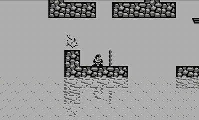

# Taxman Engine

Taxman is a 2D Game Engine designed originally for the [Playdate](https://play.date) console. However, it is not platform-dependent.

The engine is written in C for high portability and speed in small-scale devices. No optimisation has been done, as the target device is not yet available for purchase.

Taxman Engine implements a simple Entity-Component structure and scene management. The choice is based on a hunch that quick iterative prototyping and creating game jam games would be faster with EC than with ECS.

Some features of the engine are based on the idea of having 1-bit screen, but adding support for more colors is entirely possible.

## Demo

Online demo is [available here](https://mcdevon.github.io/taxman-wasm/). It is built using the [Wasm port of the engine](https://github.com/mcdevon/taxman-wasm).

The logo animation is made using transform animations and easings, including bezier curve for the jump of the `taxman` text. After the animation, scene is changed using a fade-to-black transition.

The character displays an example of frame animations. Simple water effect is made using dithering.

In order to test the engine on an actual device, a [Teensy 4.0](https://www.pjrc.com/store/teensy40.html) board was used, running at 150MHz. The display is a [Sharp memory display](https://www.sharpsma.com/products?sharpCategory=Memory%20LCD&p_p_parallel=0&sharpProductRecordId=1504552) with 400x240 resolution.

## Features

Current Features include

- Custom object type with runtime type information to allow easier memory management (destructor-like behavior)
- Scenes and transforms between scenes
- Scene Graph, Game Objects, reusable Components
- Dynamic ArrayLists, HashMaps, and String Builders, which support the memory management scheme
- Dithering to draw grayscale images
- Bitmap fonts (currently monospace only)
- Sprite atlases (currently only using LibGDX format)
- Frame animations
- Transform animations
- Easings for transform animations, including cubic bezier curves
- Tilemaps with automatic tile selection
- Platformer physics with one-directional platforms and walls
- Collision detection using sweep-and-prune algorithm
- Camera
- Pseudorandom number generator

The engine uses fixed-point numbers for in-game calculations. This is due to the original game idea needing platform-indepent deterministic game replays using only player inputs. Option to use floats instead is on the works.

There is no actual camera, as the viewport remains always in origin. But functionally there is equivalent camera node, which translates (transform, scale, and rotate supported) the node and child nodes, working as a camera is expected to work. This also allows easy HUD implementation as there is no need for multiple camera trickery.

## Rough Backlog

- How-to-use guide
- Examples of scenes, objects, components, and game state
- Audio support
- Render optimisations
- Keep 1-bit images in memory with 1-bit colors instead of 8-bit colors
- 9-sprite
- Sprite alpha using dithering
- Easier UI layout scheme using object's top-left corner as origin for child objects
- Support sprite rotation in sprite atlases
- Moving platforms and pushable objects
- Clean exit (clear all allocated memory and quit)
- Option to use floats instead of fixed-point numbers as the primary number type
- Tool to compute bezier curve values ahead-of-time
- Use user-defined resolution instead of a hard-coded one

## Contributing

All contributions, especially issues, comments, and pull request are warmly welcome. This repository is maintained as a side project, and as such, it is unfortunately not possible to guarantee frequent updates.

If you manage to get the engine running on any platform, please send me a [tweet](https://twitter.com/jussienroos).

## License

This codebase is released under the MIT License.