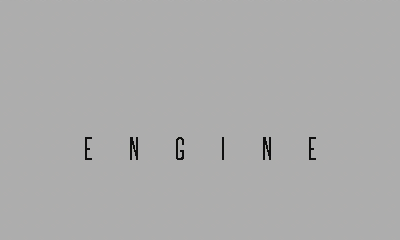

# Taxman Engine

Taxman is a 2D Game Engine designed originally for the [Playdate](https://play.date) console. However, it is not platform-dependent.

The engine is written in C for high portability and speed in small-scale devices. No optimisation has been done, as the target device is not yet available for purchase.

Taxman Engine implements a simple Entity-Component structure and scene management. The choice is based on a hunch that quick iterative prototyping and creating game jam games would be faster with EC than with ECS.

Some features of the engine are based on the idea of having 1-bit screen, but adding support for more colors is entirely possible.

To run the engine, a platform adapter is needed. Currently there are two publicly available platform adapters:

- [Wasm adapter](https://github.com/mcdevon/taxman-wasm) for running the engine in a browser
- [Playdate adapter (WIP)](https://github.com/mcdevon/taxman-playdate) for running the engine in a Playdate console

## Demo

Online demo is [available here](https://mcdevon.github.io/taxman-wasm/). It is built using the [Wasm port of the engine](https://github.com/mcdevon/taxman-wasm). The Wasm port repository contains an example of how to build a scene and add objects there, as well as how to add assets and load them.

The logo animation is made using transform animations and easings, including bezier curve for the jump of the `taxman` text. After the animation, scene is changed using a fade-to-black transition.

The character displays an example of frame animations. Simple water effect is made using dithering.

In order to test the engine on an actual device, a [Teensy 4.0](https://www.pjrc.com/store/teensy40.html) board was used, running at 150MHz. The display is a [Sharp memory display](https://www.sharpsma.com/products?sharpCategory=Memory%20LCD&p_p_parallel=0&sharpProductRecordId=1504552) with 400x240 resolution.

## Features

Current Features include

- Custom object type with runtime type information to allow easier memory management (destructor-like behavior)
- Scenes and transforms between scenes
- Scene Graph, Game Objects, reusable Components
- Dynamic ArrayLists, HashMaps, and String Builders, which support the memory management scheme
- Dithering to draw grayscale images
- Advanced dithering features for animation and effects
- Bitmap fonts (currently monospace only)
- Sprite atlases (currently only using LibGDX format)
- Render textures and off-screen rendering
- Frame animations
- Transform animations
- Easings for transform animations, including cubic bezier curves
- Precomputed bezier curves to make them run faster in embedded environments
- Tilemaps with automatic tile selection
- Platformer physics with one-directional platforms and walls
- Moving platforms and pushable objects
- Collision detection using sweep-and-prune algorithm
- Camera
- 9-sprite
- Pseudorandom number generator
- Profiler

The engine can use fixed-point numbers for in-game calculations. This is due to the original game idea needing platform-indepent deterministic game replays using only player inputs. By deafult regular floats are used.

## Rough Backlog

- How-to-use guide
- Examples of scenes, objects, components, and game state
- Audio support
- Render optimisations
- Sprite alpha using dithering
- Clean exit (clear all allocated memory and quit)
- Use user-defined resolution instead of a hard-coded one

## Contributing

All contributions, especially issues, comments, and pull request are warmly welcome. This repository is maintained as a side project, and as such, it is unfortunately not possible to guarantee frequent updates.

If you manage to get the engine running on any platform, please send me a [tweet](https://twitter.com/jussienroos).

## License

This codebase is released under the MIT License.
